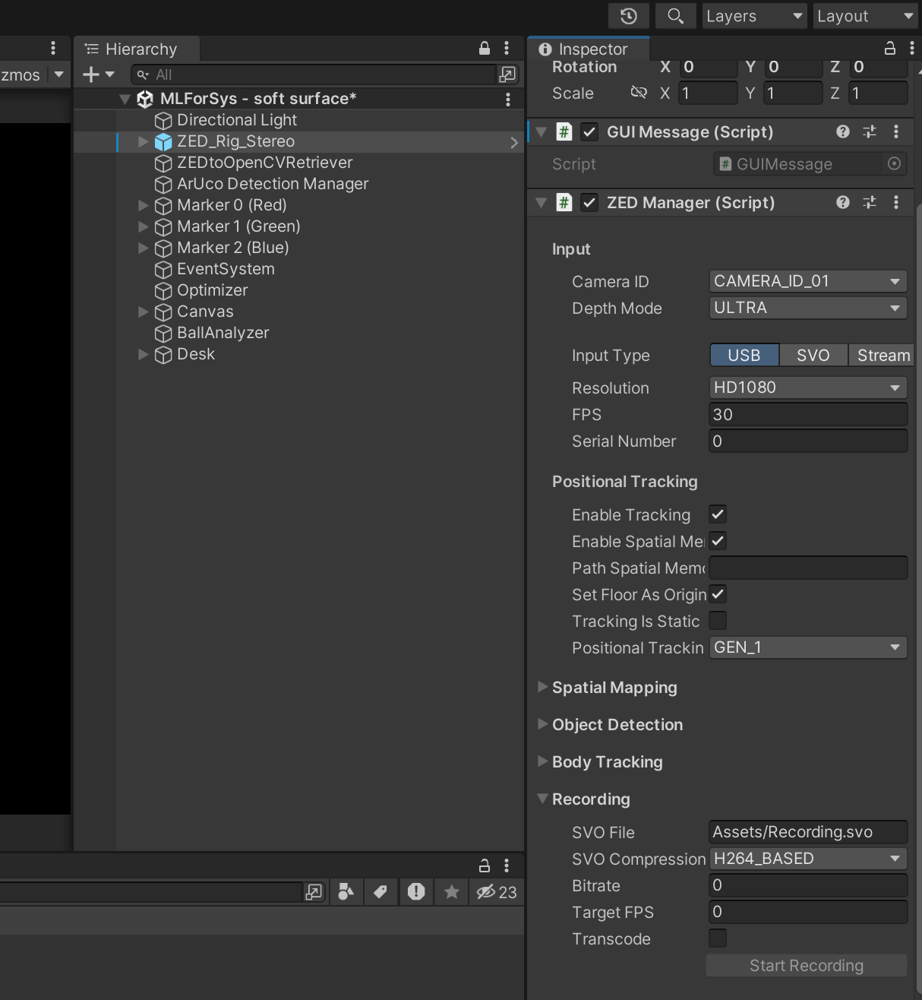
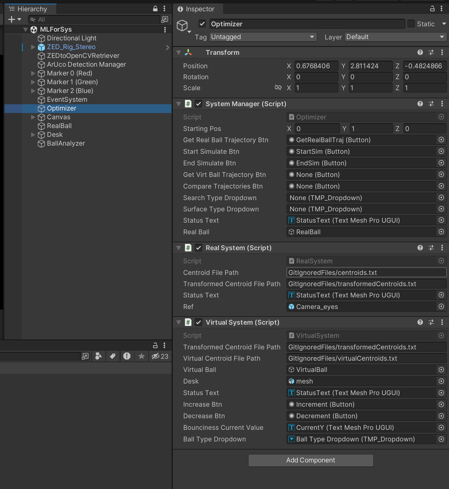
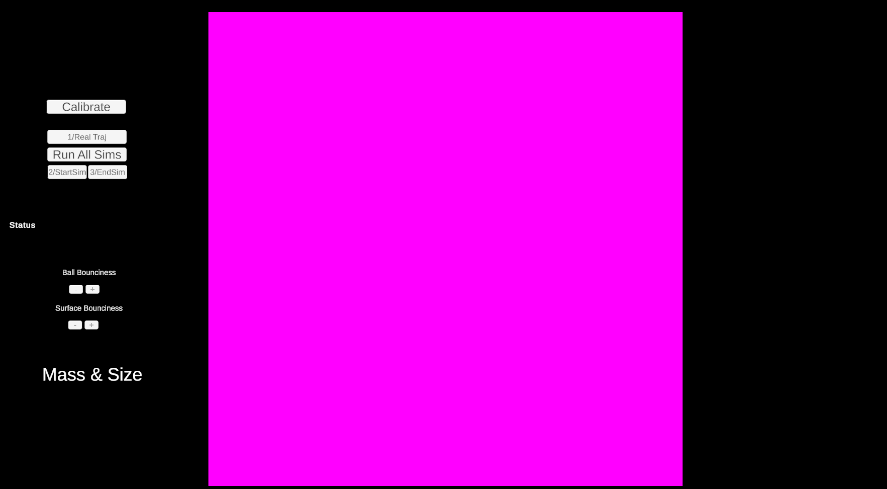

# PhyzEffect-Vive

This repository contains the resources, code, and instructions required to set up and execute the PhyzEffect-Vive system, a pipeline for analyzing real-world object interactions and simulating corresponding virtual trajectories.

---
## Environment Tested
- Windows 11
- Unity 2022.3.21f1
- Zed mini 
- HTC Vive Pro

## Steps to Set Up and Use

Follow the steps below to extract and simulate the virtual trajectory from real-world object interactions:

### 1. **Set Up the ZED Camera**
   - Install the ZED Mini or ZED2 camera as required for your setup. Please refer to this [link](https://github.com/stereolabs/zed-sdk/tree/master) for details.
   - Ensure the camera drivers and the ZED SDK are properly installed on your system.
   - Verify the camera functionality using the ZED SDK tools provided by [Stereolabs](https://www.stereolabs.com/).

### 2. **Prepare the Scene**
   - Print at least 3 ArUco markers. In this project, we used the 3 first markers from this [generator](https://chev.me/arucogen/).
   - Place the markers in the scene at distinct positions such that they form a bounding box in 3D space that fully encloses the scene.
   - Ensure the markers are clearly visible and evenly distributed across the scene.

### 3. **Scan the Real World**
   - Use [Scaniverse](https://scaniverse.com/) to create a 3D scan of the scene.
   - Verify that the ArUco markers are clearly visible in the captured scan.

### 4. **Record the Interaction**
   

   - Use the Unity app provided in the repository:
     1. Set the directory path where the recording will be saved.
     2. Press "Start recording" and perform the object interaction in the scene. Ensure the camera remains stationary.
     3. Stop the recording after completing the interaction.
   - **Note:** Sample recordings used for the final results are included in the repository. Please refer to the last section for more details.

### 5. **Export SVO Video to RGB + Depth PNG Images**
   - Use the provided ZED SDK's SVO export tool in the `project-deliverables` folder to extract RGB and depth images from the video.
   - **Run Command:**

     ```bash
     ./ZED_SVO_Export.exe "path/to/file.svo" "path/to/output/folder"
     ```

   - **Note:** Converted images for sample recordings are provided in the repository.

### 6. **Analyze Recordings to Extract Bounding Boxes**
   - Use the Python script included in the repository to analyze the recordings:
     1. Install dependencies using `pip install -r requirements.txt`.
     2. Run `3d-annotate.ipynb` and modify the `base_dir` variable for each video.
     3. The script will attempt to detect the ball. For frames where the ball is not detected, manual annotation will be required.
     4. The script generates 3 output files, but only `base_dir_full_annotation.json` is essential.
   - **Note:** Annotated data for sample recordings is provided in the repository.

### 7. **Convert Bounding Boxes to Camera Coordinates**
   - Use the ZED SDK executable to extract centroids of the detected ball:
     - **Run Command:**

       ```bash
       ZED_Object_detection_image_viewer.exe <svo> <inputfile> <outputfile>
       ```
     - You can use the `pixel2cam` script provided in the `project-deliverables` directory to process all 4 recordings.
     - The `ZED_Object_detection_image_viewer` is an executable that was built based on the ZED sdk's repository. I've modified the code so that it can accept custom bounding boxes (instead of running a detection model). You can find the source code in the `zip` file.
   - This tool processes the bounding box centroids and converts them into camera space coordinates.
   - Instructions for building the executable are available in the [ZED SDK documentation](https://www.stereolabs.com/docs/app-development/cpp/windows). A script to process sample data is also included.
   - **Note:** The 3D coordinates of the centroids in camera coordinates are also provided in the `project-deliverables` folder.

### 8. **Run the Unity Project**
   - Open the Unity project using Unity 2022.3.21f1.
   - Ensure the ZED SDK is installed and properly configured.
   - Load the `MLForSys` scene. Locate the `Optimizer` object, which has three scripts attached:
     - **`SystemManager.cs`**: Manages the overall pipeline, GUI interactions, and data flow.
     - **`RealSystem.cs`**: Processes real-world trajectory data and transforms centroid coordinates from camera space to world space using the ZED Mini camera.
     - **`VirtualSystem.cs`**: Simulates the virtual ball trajectory based on the real-world data.
   - Specify the path to the centroid file to process as in the following image and simulate the virtual trajectory.
   
   

   - `MLForSys - soft surface` scene uses the soft surface instead of the hard surface.

### 9.  **Run the Simulation to Obtain Virtual Trajectory**
   

   1. Make sure the zed-mini camera is connected to the PC. Press on the `Play` button on top. 
   2. Wait until the camera works.
   3. Press on the **`Calibrate`** button to align the scanned scene to the real-world. If you wish to change the scene, you must replace the `Desk` object.
   4. Press on the **`1/ Real Traj`** to transform the centroids from camera coordinates to world coordinates relative to the zed-mini camera.
   5. Change the bounciness factor of the desk (Desk/Scaniverse_.../mesh - BoxCollider) at runtime.
   5. Press on the **`2/StartSim`** to start the simulation of the virtual ball. A virtual ball will be instantiated at the starting position (obtained from the real-world trajectory) and will start to fall.
   6. Press on the **`3/EndSim`** to end the tracking of the virtual ball. A file (whose name can be specified in the Inspector) containing the virtual trajectory will be saved at the specified location.
   - **Note** The `Run All Sims`, `Ball Bounciness +-`, `Surface Bounciness +-` buttons does not work properly. I'm trying to fix it in order to simulate the grid search automatically.

### 10. **Analyze the Tracked Trajectories**
   - Use the `compare.ipynb` to interpolate the trajectories, and calculate the MAE. You can also visualize the results.

## project-deliverables directory
- The `project-deliverables` directory contains sample inputs/outputs used to obtain for the final results used in the submitted report.
- `project-deliverables`:
   - `MLForSys`
      - `3d-annotate.ipynb`: annotation tool for detecting bounding boxes
      - `compare.ipynb`: notebook for comparing trajectories
      - `requirements.txt`: the python requirements needed to run the above to notebooks
      - `ball<...>.svo2`: the svo recordings of the interactions. You need the zed-sdk installed to run them.
      - `ball<...>`
         - `DEPTH`: contains the depth images
         - `IMAGE`: contains the rgb images
         - `output`
            - `ball<...>_full_annotations.json`: json file that contains the bounding boxes. Result after running `3d-annotate.ipynb`.
            - `ball<...>_centroids.txt`: file that contains the centroids in camera coordinates. Obtained after step 7.
            - `ball<...>_centroids_transformed.txt`: file that contains the centroids transformed in world coordinate. Obtained after step 9.4.
            - `ball<...>_virtual_centroids_n_m_i.txt`: file that contains the centroid of the virtual ball in world coordinate. `n` is the bounciness of the virtual ball, `m` is the bounciness of the surface and `i` is the ith iteration.
   - `ZED_SVO_Export.exe`: executable used in step 5.
   - `ZED_Object_detection_image_viewer.exe`: executable used in step 7.
   - `ZED_Object_detection_image_viewer.zip`: zip file containing the code for building the executable.
   - `pixel2cam.ps1`: powershell script that runs the object detection for all 4 recordings.
   - `<...>.png`: image files used in this README.